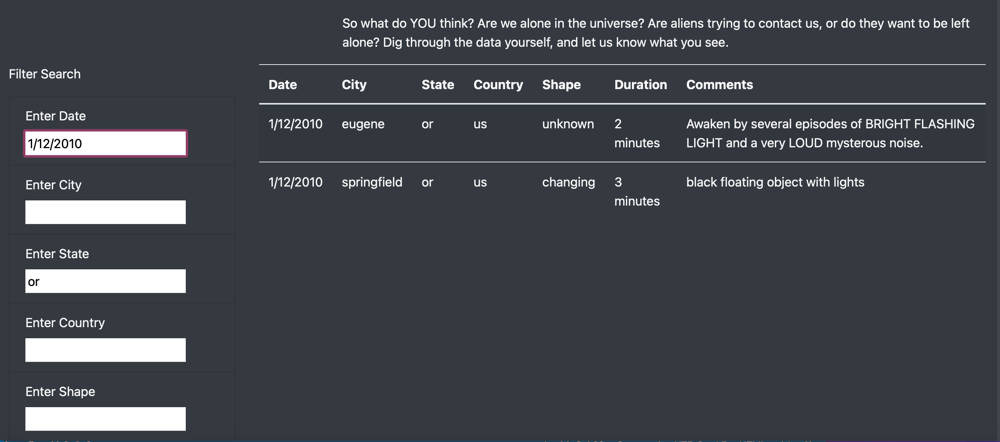

# UFOs
## Overview
### Purpose of Project
* The purpose of this project was to write HTML and bootstrap to create a webpage.
* The purpose of this webpage is to use data about UFOs that is stored as a JavaScript array.  Then put that data into a table on the webpage that can be filted by multiple elements
## Results
* The complteted webpage is very user-friendly. 
* Someone can find information about UFO sightings by filtering on the table created.  The table can filtered by 1-5 elements (city, state, date, country, shape).
* Below is an image of the table on my webpage filtered by sightings in the state of Oregon on 1/12/2010.

## Summary
### Limitations
* The webpage is user-friendly, however one drawback I noticed is that when filtering capitalization is sensitive 
* In the image above, to filter to sightings in the state of Oregon one has to input "or". If "OR" is inputted the filter doesn't work
* One way to improve this issue would be to put a format guide as the defualt in the filter box (similar to the date box)
* Another way this could be improved would be to include dropdowns for the "shape" filter.  

